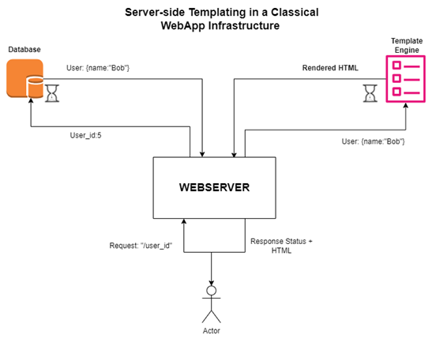

# Introduction
The rapid evolution of cloud computing has transformed the landscape of application deployment. This research project aims to design, implement, and evaluate the scalability of a Serverless and JamStack web application infrastructure hosted on the Amazon Web Services (AWS) Cloud. The objective is to investigate the effectiveness of AWS services in achieving optimal performance, reliability, and scalability for modern web applications.

# Background and Rationale:
As organizations increasingly migrate their applications to the cloud, understanding the design principles and scalability factors of cloud infrastructure becomes paramount. This research is motivated by the need to explore the best practices for designing and implementing a scalable web application infrastructure on AWS. By evaluating the performance and scalability, this study seeks to provide insights that can guide practitioners in optimizing their cloud-based deployments.

## Serverless + Jamstack WebApp Infrastructure on AWS Cloud

### JamStack:
The concept behind Jamstack revolves around optimizing the distribution of computational tasks between the client-side and server-side components of web applications. In this paradigm, the heavier computational tasks, such as templating, are delegated to the client-side browser. This shift is attributed to the increased capabilities of modern browsers, enabling them to efficiently render complex HTML templates.
Consequently, the server-side functions predominantly focus on tasks involving data retrieval and input/output operations from databases. These operations are generally less computationally intensive compared to templating processes. By offloading templating tasks to the client-side and leveraging server-side resources for data management, the overall performance and scalability of web applications are enhanced. 

### Serverless Computing (Function as a Service):
Serverless computing is a method to execute code in a cloud environment without caring about the underlying infrastructure. You deploy your application while the cloud provider takes care of the execution in response to particular 'triggers' or 'events'. This eliminates the inconvenience of managing servers.
•	No Server Management: With serverless computing, developers do not need to provision, scale, or manage servers. The cloud provider takes care of infrastructure management, including server provisioning, scaling, patching, and maintenance.
•	Function Invocation-Based Pricing: Serverless platforms typically charge based on the number of invocations or executions of your functions. Each time your function is triggered by an event (such as an HTTP request, database change, or timer-based trigger), an invocation occurs, and you are billed for that invocation.You are billed based on the duration of each invocation

## Classical WebApp Infrastructure (Old School Approach)

•	Operating a Server is necessary.

•	Servers run backend code creating a frontend template on the go: the running webserver handles each incoming request fetching data from a database, filling a template with the data and sending it back to the requesting user.

•	Hence there is a need for high-performance web servers like the APACHE HTTP web server, NGINX, and more.

•	They are really good and fast for rendering static web pages that can rendered beforehand, that is pages that do not change much) but for dynamic webpages like a user detail page displaying different users' email, name, and exam scores specific to different users, a plane web server would not suffice for that.

•	In such a dynamic case, you would need a backend that has some business logic that fetches the relevant data then fills out the blanks in a user detail template and renders it in an HTML template at the frontend together with other static resources like CSS and JavaScript.

•	That is a lot of mixed-up logic; because the server/the backend does not only need to know where and how to fetch data but also needs to transform templates with blanks in them with data that has been fetched from the database and render the template as HTML frontend.

•	At some point the concept of CDN came up to cache the static, never-changing resources like CSS/JavaScript and images but the most interesting part/the most dynamic part which is filling the blanks in the templates (templating and rendering it) still happened on the backend server.

###### NOTE: 

• The templating process on the server is typically CPU-intensive and computationally expensive. Unlike fetching data from the database, which involves simple I/O operations and can be fast, creating templates with the retrieved data and performing any necessary calculations requires significant computing resources and places a heavier load on the CPU.

• When fetching data from the database, the bulk of the computation is handled by the database itself. The server merely initiates the request and awaits the response, even in scenarios with numerous concurrent requests to the database. However, during template rendering, the server shoulders the entirety of the computational workload.

### Drawbacks of Using the Classical Approach
Scalability scenario of a web server with the capacity to handle 100 concurrent users.

#

#

#### Summary of the drawbacks of using the classical approach:
- Sluggish performance may result from computational overload, as data fetching and templating are handled by the same server.
  
- Scaling becomes imperative to accommodate increasing loads, necessitating the implementation of load balancers and autoscaling mechanisms.
  
- Operational and management overhead persists.
  
-  The requirement for servers to handle computationally intensive operations contributes to setup costs.
  
- Latency issues may arise, necessitating the installation of servers in multiple regions.

# Research Questions:

RQ1 What are the best practices for designing and implementing a Serverless and Jamstack web application infrastructure on AWS, considering factors such as security, reliability, and maintainability?

RQ2 How does the web application infrastructure perform and scale under varying workloads?

RQ3 What AWS services contribute most significantly to scalability?
